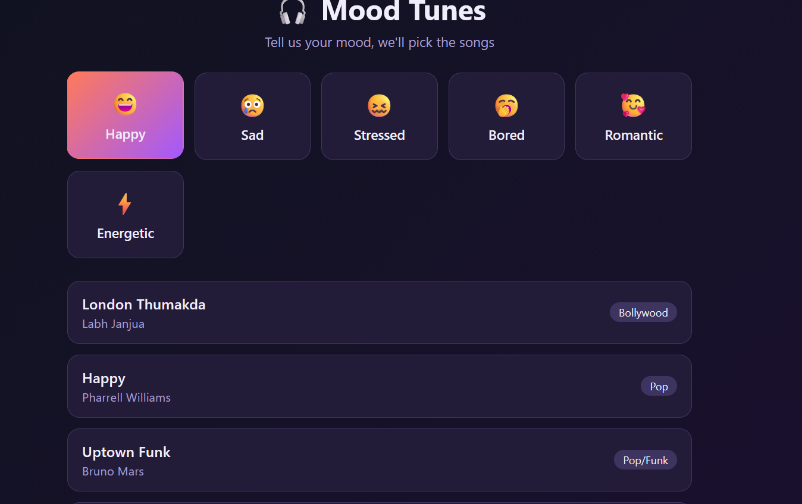

# 🎧 Mood Tunes - Mood-Based Song Recommendation

Mood Tunes is a simple and interactive web application that recommends songs based on the user's current mood. The application allows users to select a mood such as Happy, Sad, Stressed, Bored, Romantic, or Energetic and instantly displays a curated list of songs. Users can also shuffle the recommendations to discover more songs from the selected mood category.

## 🌟 Features

- 🎵 Mood-based song recommendations
- 😊 Six mood categories:
  - Happy
  - Sad
  - Stressed
  - Bored
  - Romantic
  - Energetic
- 🔀 Shuffle button for new recommendations
- 🎤 Displays song title, artist, and genre
- 📱 Responsive and user-friendly interface
- ⚡ Fast and lightweight application
- 🎨 Clean and modern UI

## 🛠️ Technologies Used

- HTML5
- CSS3
- JavaScript (ES6)

## 📁 Project Structure

```
Mood-Tunes/
│── index.html
│── style.css
│── script.js
│── songs.js
└── README.md
```

## 🚀 Getting Started

### Clone the Repository

```bash
git clone https://github.com/YOUR_USERNAME/Mood-Tunes.git
```

### Navigate to the Project Folder

```bash
cd Mood-Tunes
```

### Run the Project

Simply open **index.html** in your preferred web browser.

No additional installation or dependencies are required.

## 🎯 How It Works

1. Open the application.
2. Choose your current mood.
3. The app displays a list of recommended songs.
4. Click **Shuffle More** to get different song suggestions for the same mood.

## 😊 Available Moods

- 😄 Happy
- 😢 Sad
- 😖 Stressed
- 🥱 Bored
- 🥰 Romantic
- ⚡ Energetic

## 💡 Future Enhancements

- Spotify API integration
- YouTube music links
- Song search functionality
- Favorite playlist feature
- User login system
- More moods and song categories
- Dark/Light mode
- AI-powered personalized recommendations

## 📸 Screenshot


```
```

## 🤝 Contributing

Contributions are welcome!

1. Fork the repository.
2. Create a new branch.

```bash
git checkout -b feature-name
```

3. Commit your changes.

```bash
git commit -m "Add new feature"
```

4. Push the branch.

```bash
git push origin feature-name
```

5. Open a Pull Request.

## 📄 License

This project is licensed under the MIT License.

## 👩‍💻 Author

**Deepshikha**

If you found this project helpful, don't forget to ⭐ the repository!